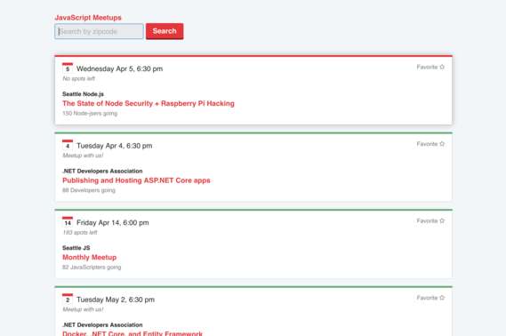

### Previewing the App
Open up `index.html` in your browser.



### Development Requirements
- Node.js (v5.4.1)
- Bower (v1.7.7)

#### Install Dependencies
```shell
npm install
bower install
```

#### Compile Sass
```shell
# This will automatically watch for changes to 'src/style.scss'
grunt

# To compile without watching for changes
grunt wiredep
grunt sass
```

### Files & Folders:
- **index.html**: Web page to view application
- **Bower files**: .bowerrc & bower.json used to incorporate meetup styleguide
- **Gruntfile.js**: setup tasks to inject components, compile Sass, and watch for changes to src/*.scss files
- **package.json**: development dependencies (Grunt, Bower)
- **dist**
  - style.min.css: compiled from style.scss and minified
  - sassquatch.min.css: compiled & minified meetup styles
- **src**
  - main.js: main application JS file
  - style.scss

